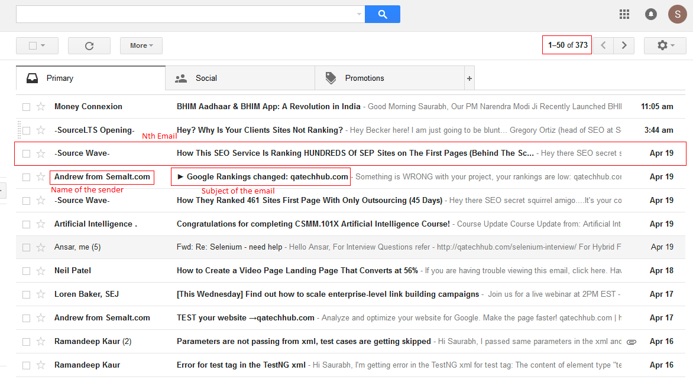

## Python Automation task

The task contains two part:
1. Unit testing
2. E2e Testing

Approximate time for completing the task: 2 hours.

Make sure to run your tests before you submit to see that you pass all of them

### Unit Testing

Before you begin, please read the following: \
[post-1](https://medium.com/@johncol/test-driven-development-and-angular-9110d62ce7ec) \
[post-2](https://hackernoon.com/what-is-so-wrong-with-tdd-aa60112aadd0) \
[post-3](https://www.agilealliance.org/glossary/tdd#q=~(infinite~false~filters~(postType~(~'page~'post~'aa_book~'aa_event_session~'aa_experience_report~'aa_glossary~'aa_research_paper~'aa_video)~tags~(~'tdd))~searchTerm~'~sort~false~sortDirection~'asc~page~1))

1. We strongly suggest that your implementation should take into account TDD approach.
2. Replace duplicate resource definitions with `DRY`* code
`*DRY` = don't repeat yourself, which just means that code should try to avoid duplications as far as possible

___
#### Product requests a new feature called AMY. It intercepts emails coming in and prioritizing them according to a predefined metric.
The developer struggles with the requirements and implementation, so after reading about the TDD approach you suggest that you will translate product's requirements into unit tests.

You wrote the following notes to yourself:
1. Each email coming into the system should have a priority, indicating the index of the message.
2. Index 0 is the most important email
3. N-1 is the least important email
4. You may assume that your inbox might contain up to N emails
5. If another email arrives, when the box is already full, and incoming email's priority is higher than least important email one, than the least important email is dropped and email box is reorganized.
6. Priority is a number in the range [0,1] (including 0 and 1)
7. Email box should be always reorganized according to the priority metric
8. You can calculate the prioiry of an email depending on 3 different characteristics. You are allowed to use the email subject as input.
9. Here are some ideas what might be considered as a good characteristics:
   
    a. Title contains the word "priority:<PRIORITY_LEVEL>". PRIORITY_LEVEL might be one of the following: [low | medium | high]

    b. Number of attached files in the email
10. The priority is a weighted sum of the characteristics.

**Todo (Each section is dependent on the previous one)**
1. Suggest 3 proper characteristics (you can use section 9)
2. Provide a test suite for amy.py

3. The provided test suite didn't help the developer. Use the test suite that you provided and implement AMY
 

### E2E Testing
Steps 1-4 do not require any automation - you can do them manually

Steps 5-10 require automation - you should implement this in code

1. Open a browser of your choice say Mozilla Firefox
2. Navigate to Gmail (https://www.gmail.com)
3. Create a gmail account
4. Using this account, subscribe to multiple services so that the inbox will be filled with promotion emails.
5. Please provide credentials in your solution for this account, so we will be able to access it.
____
5. Login to this Gmail with correct credentials.
6. Verify that “Promotion” section is selected.
7. If not click on the Primary tab.
8. Get the count of the total number of emails in the Primary tab.
9. Get the name of the sender and subject of Nth Email of your inbox.
10. Write a method to get the name of the sender and subject of email of your inbox.

Please refer below screenshot for the same.

